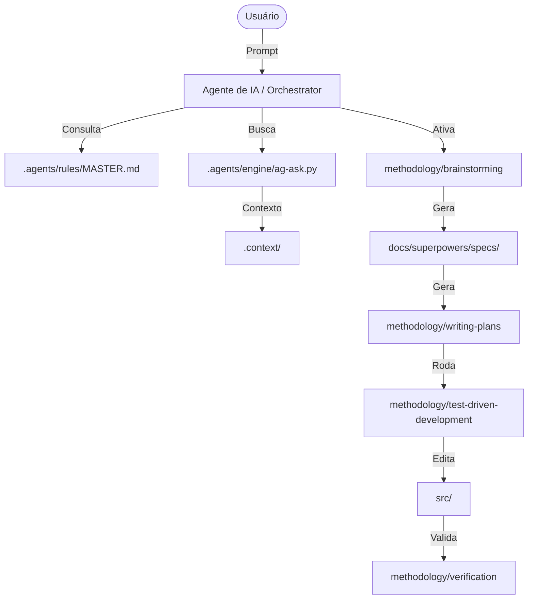

# ARCHITECTURE: The Three Pillars of Kit Supremo

Este documento detalha a integração técnica entre o Workspace Template, o Antigravity Kit e o Superpowers.

## 🏗️ 1. O Corpo (Workspace Template)
A infraestrutura base é baseada em uma **Arquitetura Cognitiva de Arquivo Único** (Single-File Cognitive Architecture).
- **Entrada de Contexto:** O IDE (Claude Code, Cursor) lê o `README.md`, `CLAUDE.md` e `.cursorrules` no bootstrap da sessão.
- **Indexação Semântica:** A pasta `.context/` e o engine Python em `.agents/engine/` permitem que o Agente faça buscas contextuais profundas sem estourar o limite de tokens da janela principal.
- **Regras Mestre:** O arquivo [MASTER.md](file:///c:/Users/phpel/OneDrive/Documentos/kit_supremo/.agents/rules/MASTER.md) atua como a constituição do repositório.

## 🧠 2. O Cérebro (Antigravity Kit)
O sistema de Habilidades (Skills) é modular e desacoplado.
- **Descoberta:** As Skills em `.agents/skills/` são auto-descobertas através do frontmatter YAML em seus arquivos `SKILL.md`.
- **Especialização:** Cada sub-pasta representa um agente especialista (ex: `integrations-supabase`, `frontend-design`).
- **Workflows:** Os arquivos em `.agents/workflows/` mapeiam processos complexos de múltiplos agentes para comandos simples da IDE.

## 🛡️ 3. A Disciplina (Superpowers)
A camada de controle que garante a qualidade da engenharia.
- **The Socratic Gate:** Implementado na skill `methodology/brainstorming`. Impede a IA de codar sem um design aprovado.
- **Plan-Driven:** A skill `methodology/writing-plans` cria o roteiro de execução.
- **TDD (The Iron Law):** A skill `methodology/test-driven-development` deleta código que não foi precedido por um teste que falha.

---

## 🔄 Fluxo de Dados e Interações

## 📍 Localização de Referências de Infraestrutura
Diferente de projetos padrão, o Kit Supremo consolida dados de produção/instância (URL, Keys, Accounts) em arquivos `.md` dentro das próprias Skills de integração (`references/infrastructure.md`), garantindo isolamento de contexto.

---
*Assinado: Arquiteto Supremo*
